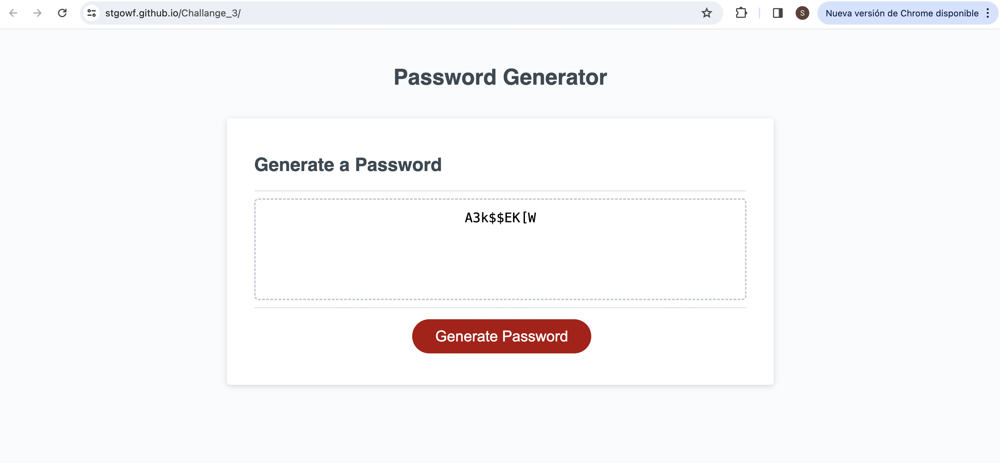

# Password Generator

## Overview
This utility generates strong, secure passwords with user-defined criteria, leveraging JavaScript to enhance web security practices. Responsive design ensures functionality across all devices.

## Features
- **Customizable Length**: Users can specify the password length between 8 and 128 characters.
- **Character Types**: Options to include special, numeric, lowercase, and uppercase characters.
- **Responsive**: Works well on both desktop and mobile browsers.

## Screenshot

## Live Demo
Experience the Password Generator [here](https://stgowf.github.io/JSPasswordGenerator/).

## Usage
1. Access the live tool using the link above.
2. Press 'Generate Password' to start.
3. Select desired password criteria when prompted.
4. Copy the generated password from the text area.

## Getting Started
To view the website locally, clone this repository and open index.html in your web browser.

## Contributing
Contributions are welcome! Please feel free to fork the repository and open a pull request with your proposed changes. Your suggestions and improvements are highly appreciated. Thank you for your support and contribution to this project.

Thank you for checking out my Password Generator!
